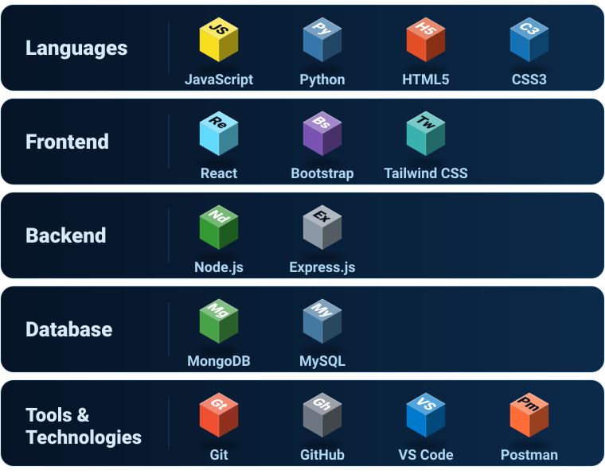
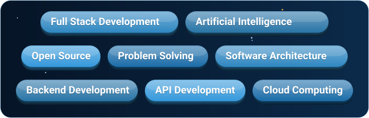

  

  

  

  

I'm a passionate software developer who enjoys building modern web applications and exploring new technologies. I love solving real-world problems through code and continuously improving my development skills.

I have experience working with frontend and backend technologies, and I'm always excited to learn something new. Currently, my main focus is **Artificial Intelligence** and how it can be integrated into web applications to create smarter and more efficient solutions.

I believe that learning never stops, and every project is an opportunity to grow as a developer.

  

  

  

I'm currently expanding my knowledge in Artificial Intelligence and modern software engineering.

  
  
  

My current learning journey includes:

 &nbsp;Artificial Intelligence (AI) 
 &nbsp;Machine Learning fundamentals 
 &nbsp;AI integration with web applications 
 &nbsp;Python for AI development 
 &nbsp;Vector Databases 
 &nbsp;Large Language Models (LLMs) 
 &nbsp;Retrieval-Augmented Generation (RAG) 
 &nbsp;AI Agents 
 &nbsp;Cloud deployment for AI applications 
 &nbsp;Docker 
 &nbsp;Prompt Engineering 
 &nbsp;AI application security 
 &nbsp;Data processing and automation 

My goal is to build intelligent applications that combine modern web development with AI technologies.

  

  

  

  
  

  

  

 &nbsp;Participant – Bahir Dar University (BDU) Hackathon 
 &nbsp;Built personal and academic software projects 
 &nbsp;Continuously learning modern software development and AI technologies 
 &nbsp;Actively improving my skills through hands-on coding and real-world projects 

  

 &nbsp;Build high-quality open-source projects 
 &nbsp;Contribute to open-source communities 
 &nbsp;Learn new technologies every day 
 &nbsp;Share knowledge with other developers 
 &nbsp;Create impactful AI-powered applications 

  

  
  
  

Feel free to reach out if you'd like to collaborate on projects, discuss technology, or connect with me.

  

 &nbsp;**GitHub Projects** — planning and tracking my work across repos

 &nbsp;**GitHub Actions (CI/CD)** — automated builds, tests, and deployments

 &nbsp;**Issues** — tracking bugs and feature requests

 &nbsp;**Discussions** — collaborating and exchanging ideas on select projects

 &nbsp;**Releases** — versioned releases for my projects

 &nbsp;**GitHub Pages** — hosting live demos and project documentation

  

⭐ Thanks for visiting my profile! Feel free to explore my repositories and don't forget to leave a ⭐ if you find something interesting!

